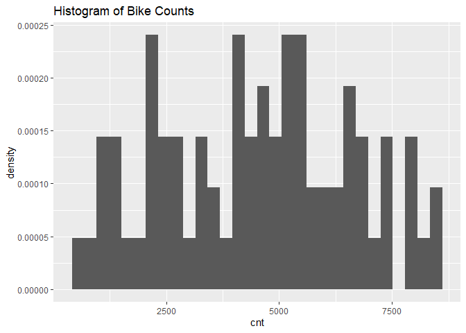

Project\_2
================
Taylor Ashby
10/16/2020

# Introduction

For this analysis, our goal is to predict the daily count of bikes used
from a Washington, D.C.-area bike sharing service. There are several
variables included that we would expect to influence how many bikes are
used. For this analysis, we will focus on the following variables:
season, yr, mnth, workingday, weathersit, atemp, and windspeed.
Descriptions of these variables can be found
[here](https://archive.ics.uci.edu/ml/datasets/Bike+Sharing+Dataset).

We will use two methods to model the *cnt* variable: regression tree and
boosted tree model. A regression tree is a model that splits data into
regions and makes a prediction based on the mean value within a given
region. A boosted tree model is a way to enhance the prediction by
growing trees sequentially by modeling the residuals of the previous
tree.

The first thing we need to is to read in the data. Here we will also
drop the casual and registered variables, as they are classifications
that are not relevant to our analysis of the total daily bike count. We
will then filter to the weekday of interest.

``` r
#Read in bike share data
bike<-read_csv("day.csv")
```

    ## Parsed with column specification:
    ## cols(
    ##   instant = col_double(),
    ##   dteday = col_date(format = ""),
    ##   season = col_double(),
    ##   yr = col_double(),
    ##   mnth = col_double(),
    ##   holiday = col_double(),
    ##   weekday = col_double(),
    ##   workingday = col_double(),
    ##   weathersit = col_double(),
    ##   temp = col_double(),
    ##   atemp = col_double(),
    ##   hum = col_double(),
    ##   windspeed = col_double(),
    ##   casual = col_double(),
    ##   registered = col_double(),
    ##   cnt = col_double()
    ## )

``` r
#Drop casual and registered variables, then filter to desired weekday
bike<-select(bike,-casual,-registered) %>% filter(weekday==params$day)
```

Next we need to split the data into a training and test set.

``` r
#Partition into training and test sets
set.seed(123)
bikeIndex<-createDataPartition(bike$cnt,p=0.7,list=FALSE)
bikeTrain<-bike[bikeIndex,]
bikeTest<-bike[bikeIndex,]
```

Before we begin modeling the *cnt* variable, we should view summary
statistics and plot some of the variables to better understand the data
and their relationships with the variable of interest.

``` r
#View summary statistics for training data
summary(bikeTrain,digits=2)
```

    ##     instant        dteday               season          yr           mnth     
    ##  Min.   : 15   Min.   :2011-01-15   Min.   :1.0   Min.   :0.0   Min.   : 1.0  
    ##  1st Qu.:209   1st Qu.:2011-07-28   1st Qu.:2.0   1st Qu.:0.0   1st Qu.: 4.0  
    ##  Median :368   Median :2012-01-03   Median :3.0   Median :0.5   Median : 7.0  
    ##  Mean   :377   Mean   :2012-01-11   Mean   :2.6   Mean   :0.5   Mean   : 6.9  
    ##  3rd Qu.:549   3rd Qu.:2012-07-01   3rd Qu.:4.0   3rd Qu.:1.0   3rd Qu.:10.0  
    ##  Max.   :729   Max.   :2012-12-29   Max.   :4.0   Max.   :1.0   Max.   :12.0  
    ##     holiday     weekday    workingday   weathersit       temp     
    ##  Min.   :0   Min.   :6   Min.   :0    Min.   :1.0   Min.   :0.20  
    ##  1st Qu.:0   1st Qu.:6   1st Qu.:0    1st Qu.:1.0   1st Qu.:0.33  
    ##  Median :0   Median :6   Median :0    Median :1.0   Median :0.43  
    ##  Mean   :0   Mean   :6   Mean   :0    Mean   :1.4   Mean   :0.48  
    ##  3rd Qu.:0   3rd Qu.:6   3rd Qu.:0    3rd Qu.:2.0   3rd Qu.:0.66  
    ##  Max.   :0   Max.   :6   Max.   :0    Max.   :3.0   Max.   :0.86  
    ##      atemp           hum         windspeed          cnt      
    ##  Min.   :0.21   Min.   :0.19   Min.   :0.045   Min.   : 627  
    ##  1st Qu.:0.33   1st Qu.:0.52   1st Qu.:0.153   1st Qu.:2737  
    ##  Median :0.43   Median :0.61   Median :0.191   Median :4618  
    ##  Mean   :0.46   Mean   :0.61   Mean   :0.201   Mean   :4526  
    ##  3rd Qu.:0.61   3rd Qu.:0.72   3rd Qu.:0.235   3rd Qu.:6164  
    ##  Max.   :0.80   Max.   :0.91   Max.   :0.507   Max.   :8555

``` r
#view the distribution of the variable of interest
g<-ggplot(bikeTrain,aes(x=cnt,y=..density..))
g+geom_histogram()+labs(title="Histogram of Bike Counts")#how to fix y-axis %s
```

    ## `stat_bin()` using `bins = 30`. Pick better value with `binwidth`.

<!-- -->

``` r
#Create scatterplots for variables that are likely to be important predictors
g<-ggplot(bikeTrain,aes(y=cnt,fill=as.factor(workingday)))

g+geom_boxplot()+ylab("Bike Count")+xlab("Is it a Working Day?")+ 
  labs(title="Relationship of workingday to cnt") #why is x-axis -0.2 to 0.2?
```

<!-- -->

``` r
g<-ggplot(bikeTrain,aes(y=cnt,fill=as.factor(weathersit)))

g+geom_boxplot()+ylab("Bike Count")+xlab("What is the weather like")+ 
  labs(title="Relationship of weathersit to cnt") #why is x-axis -0.2 to 0.2?
```

<!-- -->

``` r
g<-ggplot(bikeTrain,aes(y=cnt,fill=as.factor(season)))

g+geom_boxplot()+ylab("Bike Count")+xlab("What season is it?")+ 
  labs(title="Relationship of season to cnt") #why is x-axis -0.2 to 0.2?
```

<!-- -->

It looks like there are a few variables we will not need for modeling.
It will be easier to work with if we simply remove those from the
training data set.

``` r
#first remove variables that are not applicable for prediction of cnt
bikeTrain<-bikeTrain %>% select(-instant,-dteday)

#we can also remove variables where their information is captured by other variables
#i.e., we do not need to include the weekday and workingday indicators since we are
#going to create separate reports for each weekday.
bikeTrain<-bikeTrain %>% select(-holiday,-weekday,-workingday,-temp, -hum)
```

Now we are ready to fit the models. First we will fit a tree model,
which separates the data into regions and uses the mean of the a given
region to predict the responses. Then we will try a boosted tree model.
This approach grows many trees sequentially, modeling residuals as the
responses. By aggregating over many trees, we lose some
interpretability, but the predictions should be better.

As we fit the models, we are also using “leave one out” cross-validation
to determine the optimal values of the tuning parameters so that we can
get the optimal model fit. The output will automatically use the
bestTune values of these parameters when we go to make predictions.

``` r
#now we are ready to fit the tree
train_control<-trainControl(method="LOOCV")
treeFit<-train(cnt ~ ., data=bikeTrain, method="rpart", 
               preProcess=c("center","scale"),
               trControl=train_control, 
               tuneGrid=NULL)
treeFit$results
```

    ##          cp     RMSE   Rsquared      MAE
    ## 1 0.1102965 1745.057 0.33745112 1398.172
    ## 2 0.1329417 1799.446 0.28468083 1491.308
    ## 3 0.4042212 2409.933 0.03559748 2149.537

``` r
treeFit$bestTune
```

    ##          cp
    ## 1 0.1102965

``` r
#boosted tree model
boostFit<-train(cnt ~ ., data=bikeTrain, method="gbm", 
                preProcess=c("center","scale"),
                trControl=train_control, 
                tuneGrid=NULL, verbose=FALSE) #why does it produce all those different iterations, with no apparent variation?

boostFit$results
```

    ##   n.trees interaction.depth shrinkage n.minobsinnode      RMSE  Rsquared
    ## 1      50                 1       0.1             10 1137.0432 0.7157745
    ## 2      50                 2       0.1             10 1074.9046 0.7435987
    ## 3      50                 3       0.1             10 1054.2549 0.7509248
    ## 4     100                 1       0.1             10 1040.5027 0.7558593
    ## 5     100                 2       0.1             10 1011.1690 0.7679965
    ## 6     100                 3       0.1             10 1026.9957 0.7601062
    ## 7     150                 1       0.1             10 1031.3296 0.7585072
    ## 8     150                 2       0.1             10  993.2106 0.7757667
    ## 9     150                 3       0.1             10 1022.9285 0.7622138
    ##        MAE
    ## 1 815.9572
    ## 2 777.5575
    ## 3 781.5721
    ## 4 743.4733
    ## 5 727.8263
    ## 6 754.4411
    ## 7 749.7267
    ## 8 711.9426
    ## 9 749.8439

``` r
boostFit$bestTune
```

    ##   n.trees interaction.depth shrinkage n.minobsinnode
    ## 8     150                 2       0.1             10

Finally, we will make predictions using our best model fits and data
from the test set. We can compare RMSE to determine which one is best
(smaller RMSE is better).

``` r
#predict values on test set and compare RMSEs
treePred<-predict(treeFit,newdata=dplyr::select(bikeTest,-cnt))
postResample(treePred,bikeTest$cnt)
```

    ##         RMSE     Rsquared          MAE 
    ## 1424.9460392    0.5371629 1109.7544703

``` r
boostPred<-predict(boostFit,newdata=dplyr::select(bikeTest,-cnt))
postResample(boostPred,bikeTest$cnt)
```

    ##        RMSE    Rsquared         MAE 
    ## 631.7983167   0.9093771 458.6090651

As expected, the boosted tree tends to have lower RMSE when applied to
the test data. By fitting multiple trees sequentially, rather than just
a single tree, the boosting method provides a better prediction.
